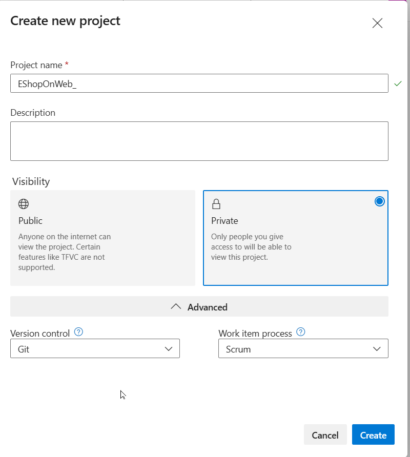
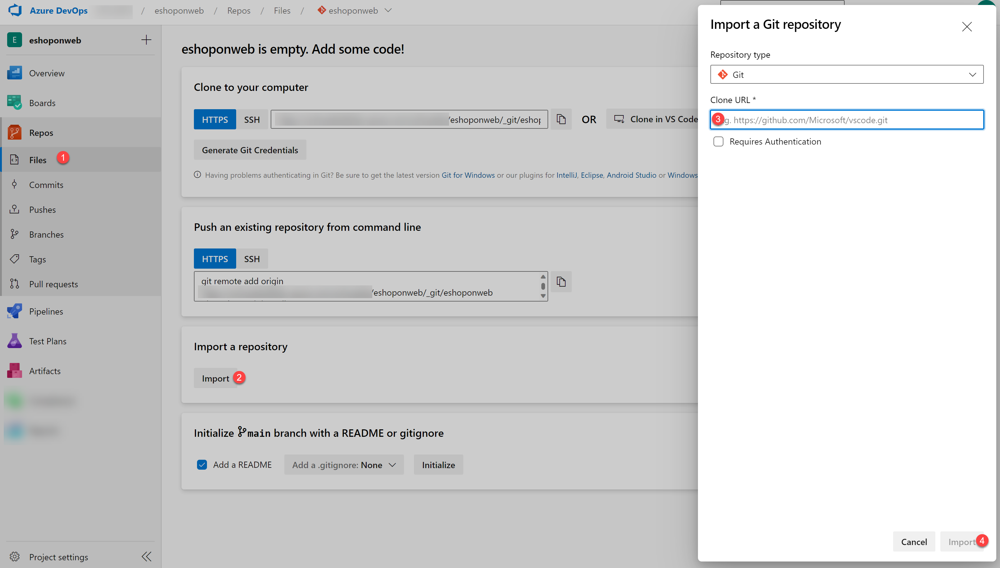
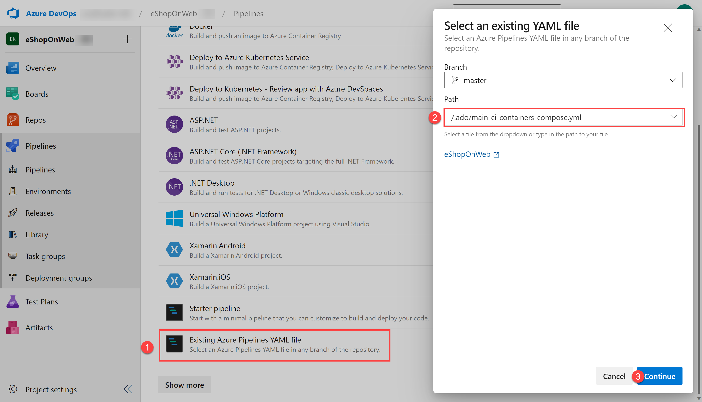
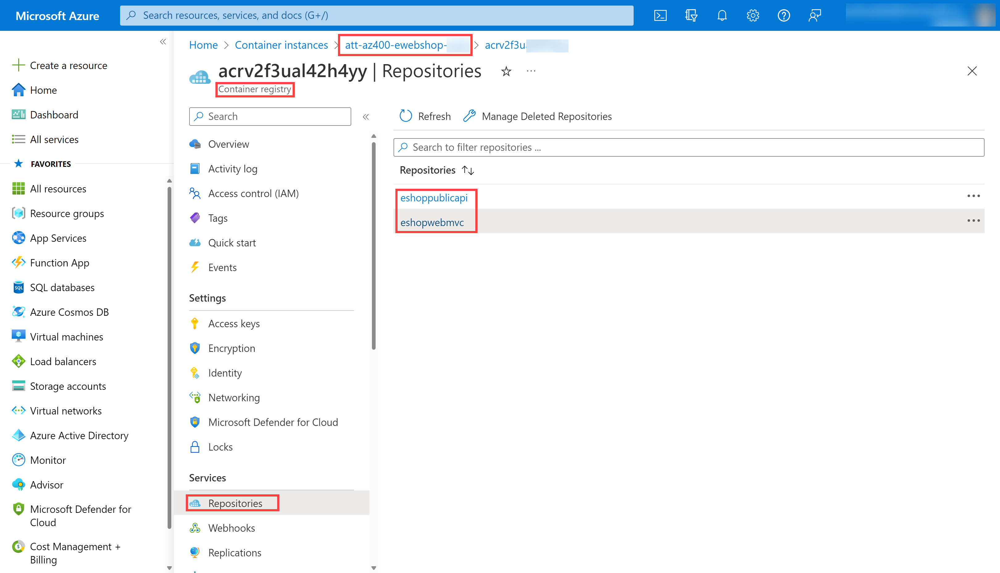
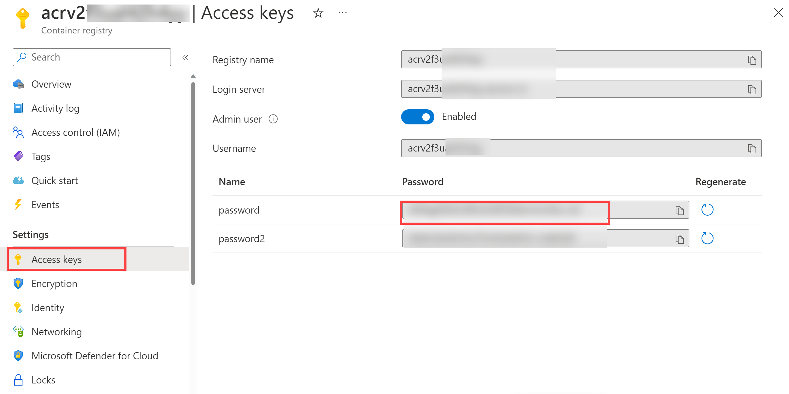
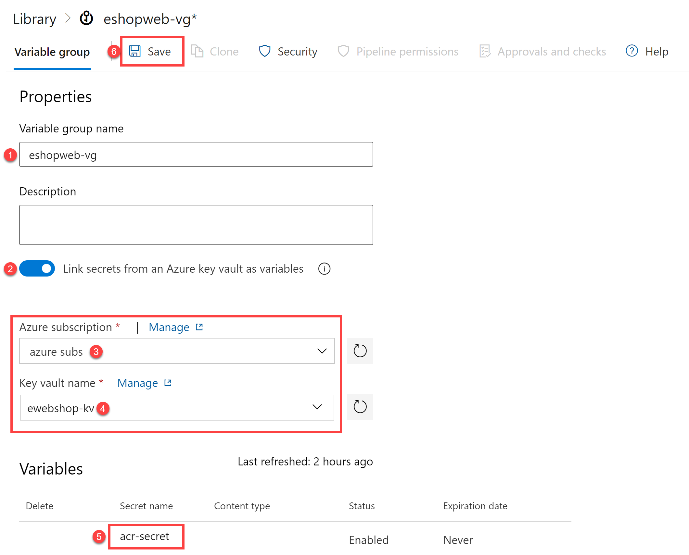

---
lab:
  title: Integrate Azure Key Vault with Azure DevOps
  description: Learn how to integrate Azure Key Vault with an Azure Pipeline to securely store and retrieve sensitive data such as passwords and keys.
  islab: true
  primarytopics:
    - Azure
    - Azure DevOps
    - Azure Key Vault
---

# Integrate Azure Key Vault with Azure DevOps

You will learn how to integrate Azure Key Vault with an Azure Pipeline to securely store and retrieve sensitive data such as passwords and keys. You'll create an Azure Key Vault, store an Azure Container Registry password as a secret, and configure a pipeline to retrieve and use that secret for container deployment.

This lab takes approximately **40** minutes to complete.

## Before you start

You need:

- **Microsoft Edge** or an [Azure DevOps supported browser](https://learn.microsoft.com/azure/devops/server/compatibility)
- **Azure subscription:** You need an active Azure subscription or can create a new one
- **Azure DevOps organization:** Create one at [Create an organization or project collection](https://learn.microsoft.com/azure/devops/organizations/accounts/create-organization) if you don't have one

## About Azure Key Vault

Azure Key Vault provides secure storage and management of sensitive data, such as keys, passwords, and certificates. It includes support for hardware security modules, as well as a range of encryption algorithms and key lengths. By using Azure Key Vault, you can minimize the possibility of disclosing sensitive data through source code, which is a common mistake made by developers. Access to Azure Key Vault requires proper authentication and authorization, supporting fine-grained permissions to its content.

## Create and configure the team project

First, you'll create an Azure DevOps project for this lab.

1. In your browser, open your Azure DevOps organization
1. Select **New Project**
1. Give your project the name **eShopOnWeb**
1. Leave other fields with defaults
1. Select **Create**

   

## Import the eShopOnWeb Git Repository

Next, you'll import the sample repository that contains the application code.

1. In your Azure DevOps organization, open the **eShopOnWeb** project
1. Select **Repos > Files**
1. Select **Import**
1. In the **Import a Git Repository** window, paste this URL: `https://github.com/MicrosoftLearning/eShopOnWeb.git`
1. Select **Import**

   

The repository is organized this way:

- **.ado** folder contains Azure DevOps YAML pipelines
- **.devcontainer** folder contains setup to develop using containers
- **infra** folder contains Bicep & ARM infrastructure as code templates
- **.github** folder contains YAML GitHub workflow definitions
- **src** folder contains the .NET 8 website used in the lab scenarios

1. Go to **Repos > Branches**
1. Hover on the **main** branch then select the ellipsis on the right
1. Select **Set as default branch**

## Setup CI pipeline to build eShopOnWeb container

You'll create a CI pipeline that builds and pushes container images to an Azure Container Registry (ACR).
### Create Resource Group

1. Go to Azure Portal, search for **Resource Group** on the top search bar.
2. Click on **Create** and specify the Resource Group Name as AZ400-EWebShop-**(your-initials)**.
3. Select region as Central US.
4. Click on Review + Create and then click on Create.

### Setup service connection

An Azure Resource Manager service connection allows you to connect to Azure resources like Azure Key Vault from your pipeline. This connection lets you use a pipeline to deploy to Azure resources, such as an Azure App Service app, without needing to authenticate each time.

1. In the Azure DevOps project, go to **Project settings > Service connections**.
1. Select **Create service connection**, then select **Azure Resource Manager** and **Next**.
1. In the **New Azure service connection** pane, verify the following settings and then select **Save**:
   - **Identity type**: App registration (automatic)
   - **Credential**: Workload identity federation
   - **Scope level**: Subscription
   - **Subscription**: _Select the subscription you are using for this lab_
   - **Service Connection Name**: `azure subs`
   - **Grant access permission to all pipelines**: Enabled

### Setup and Run CI pipeline

You'll import an existing CI YAML pipeline definition that creates an Azure Container Registry and builds/publishes container images.

1. From your lab computer, navigate to the Azure DevOps **eShopOnWeb** project
1. Go to **Pipelines > Pipelines** and select **Create Pipeline** (or **New pipeline**)
1. On the **Where is your code?** window, select **Azure Repos Git (YAML)**
1. Select the **eShopOnWeb** repository
1. On the **Configure** section, choose **Existing Azure Pipelines YAML file**
1. Select branch: **main**
1. Provide the path: **/.ado/eshoponweb-ci-dockercompose.yml**
1. Select **Continue**

   

1. In the YAML pipeline definition, customize your Resource Group name by replacing **NAME** in **AZ400-EWebShop-NAME** with a unique value
1. Replace **YOUR-SUBSCRIPTION-ID** with your own Azure subscription ID
1. Select **Save and Run** and wait for the pipeline to execute successfully

    > **Important**: If you see the message "This pipeline needs permission to access resources before this run can continue to Docker Compose to ACI", select on View, Permit and Permit again. This is needed to allow the pipeline to create the resource.

The build definition consists of these tasks:

- **AzureResourceManagerTemplateDeployment** uses **bicep** to deploy an Azure Container Registry
- **PowerShell** task takes the bicep output (ACR login server) and creates pipeline variable
- **DockerCompose** task builds and pushes the container images for eShopOnWeb to the Azure Container Registry

1. Your pipeline will take a name based on the project name. Let's **rename** it for better identification
1. Go to **Pipelines > Pipelines** and select the recently created pipeline
1. Select the ellipsis and **Rename/Remove** option
1. Name it **eshoponweb-ci-dockercompose** and select **Save**

1. Once execution is finished, in the Azure Portal, open the previously defined Resource Group
1. You should find an Azure Container Registry (ACR) with the created container images **eshoppublicapi** and **eshopwebmvc**

1. Select **Access Keys**, enable the **Admin user** if not done already, and copy the **password** value

You'll use this password in the following task as a secret in Azure Key Vault.

## Create an Azure Key Vault

You'll create an Azure Key Vault to store the ACR password as a secret.

1. In the Azure portal, in the **Search resources, services, and docs** text box, type **Key vault** and press **Enter**
1. Select **Key vault** blade, select **Create > Key Vault**
1. On the **Basics** tab of the **Create a key vault** blade, specify these settings and select **Next**:

   | Setting                       | Value                                                           |
   | ----------------------------- | --------------------------------------------------------------- |
   | Subscription                  | the name of the Azure subscription you are using in this lab    |
   | Resource group                | the name of your resource group **AZ400-EWebShop-NAME**         |
   | Key vault name                | any unique valid name, like **ewebshop-kv-NAME** (replace NAME) |
   | Region                        | an Azure region close to the location of your lab environment   |
   | Pricing tier                  | **Standard**                                                    |
   | Days to retain deleted vaults | **7**                                                           |
   | Purge protection              | **Disable purge protection**                                    |

1. On the **Access configuration** tab, select **Vault access policy**
1. In the **Access policies** section, select **+ Create** to setup a new policy

   > **Note**: You need to secure access to your key vaults by allowing only authorized applications and users. To access the data from the vault, you need to provide read (Get/List) permissions to the service connection for authentication in the pipeline.

1. On the **Permission** blade, below **Secret permissions**, check **Get** and **List** permissions
1. Select **Next**
1. On the **Principal** blade, search for your **Azure subscription service connection**

   > **Note**: To see how the principal for your service connection is identified, in Azure DevOps, you can navigate to **Project settings > Service connections > azure subs** and open the link **Manage App registration**. This will open a new Azure Portal tab with the principal's name and Application ID that you can use to find it in the previous step.

1. Select it from the list and select **Next**, **Next**, **Create** (access policy)
1. Back on the **Create a key vault** blade, select **Review + Create > Create**

    > **Note**: Wait for the Azure Key Vault to be provisioned. This should take less than 1 minute.

1. On the **Your deployment is complete** blade, select **Go to resource**
1. On the Azure Key Vault blade, in the vertical menu on the left side, in the **Objects** section, select **Secrets**
1. On the **Secrets** blade, select **Generate/Import**
1. On the **Create a secret** blade, specify these settings and select **Create**:

| Setting        | Value                                       |
| -------------- | ------------------------------------------- |
| Upload options | **Manual**                                  |
| Name           | **acr-secret**                              |
| Secret value   | ACR access password copied in previous task |

## Create a Variable Group connected to Azure Key Vault

You'll create a Variable Group in Azure DevOps that will retrieve the ACR password secret from Key Vault.

1. On your lab computer, navigate to the Azure DevOps project **eShopOnWeb**
1. In the vertical navigational pane, select **Pipelines > Library**
1. Select **+ Variable Group**
1. On the **New variable group** blade, specify these settings:

   | Setting                              | Value                                               |
   | ------------------------------------ | --------------------------------------------------- |
   | Variable Group Name                  | **eshopweb-vg**                                     |
   | Link secrets from an Azure Key Vault | **enable**                                          |
   | Azure subscription                   | **Available Azure service connection > Azure subs** |
   | Key vault name                       | Your key vault name                                 |

1. Under **Variables**, select **+ Add** and select the **acr-secret** secret
1. Select **OK**
1. Select **Save**

   

## Setup CD Pipeline to deploy container in Azure Container Instance (ACI)

You'll import a CD pipeline, customize it, and run it to deploy the container image in an Azure Container Instance.

1. From your lab computer, navigate to the Azure DevOps **eShopOnWeb** project
1. Go to **Pipelines > Pipelines** and select **New Pipeline**
1. On the **Where is your code?** window, select **Azure Repos Git (YAML)**
1. Select the **eShopOnWeb** repository
1. On the **Configure** section, choose **Existing Azure Pipelines YAML file**
1. Select branch: **main**
1. Provide the path: **/.ado/eshoponweb-cd-aci.yml**
1. Select **Continue**

1. In the YAML pipeline definition, customize:

   - **YOUR-SUBSCRIPTION-ID** with your Azure subscription id
   - **az400eshop-NAME** replace NAME to make it globally unique
   - **YOUR-ACR.azurecr.io** and **ACR-USERNAME** with your ACR login server (both need the ACR name, can be reviewed on the ACR > Access Keys)
   - **AZ400-EWebShop-NAME** with the resource group name created before in the lab

1. Select **Save and Run**
1. Open the pipeline and wait for it to execute successfully

    > **Important**: If you see the message "This pipeline needs permission to access resources before this run can continue to Docker Compose to ACI", select on View, Permit and Permit again. This is needed to allow the pipeline to create the resource.

The CD definition consists of these tasks:

- **Resources**: prepared to automatically trigger based on CI pipeline completion. It also downloads the repository for the bicep file
- **Variables (for Deploy stage)** connects to the variable group to consume the Azure Key Vault secret **acr-secret**
- **AzureResourceManagerTemplateDeployment** deploys the Azure Container Instance (ACI) using bicep template and provides the ACR login parameters to allow ACI to download the previously created container image from Azure Container Registry (ACR)

1. To verify the results of the pipeline deployment, in the Azure portal, search for and select the **AZ400-EWebShop-NAME** resource group
1. In the list of resources, verify that the **az400eshop** container instance was created by the pipeline
1. Rename the pipeline to **eshoponweb-cd-aci** for better identification

## Clean up resources

Remember to delete the resources created in the Azure portal to avoid unnecessary charges:

1. In the Azure portal, navigate to the **AZ400-EWebShop-NAME** resource group
1. Select **Delete resource group**
1. Type the resource group name to confirm deletion
1. Select **Delete**

## Summary

In this lab, you integrated Azure Key Vault with Azure DevOps pipeline by:

- Creating an Azure Key Vault to store an ACR password as a secret
- Providing access to secrets in the Azure Key Vault
- Configuring permissions to read the secret
- Configuring a pipeline to retrieve the password from the Azure Key Vault and pass it to subsequent tasks
- Deploying a container image to Azure Container Instance (ACI) using the secret
- Creating a Variable Group connected to Azure Key Vault

Azure Key Vault integration with Azure DevOps enables secure handling of sensitive data in your CI/CD pipelines, following security best practices by keeping secrets out of your source code and configuration files.
